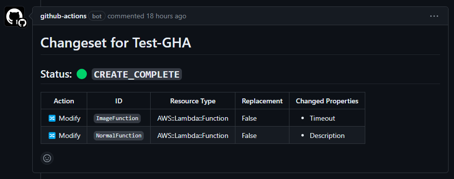

# Build Changeset Comment Action

This GitHub Action creates a GitHub Flavored Markdown (GFMD) comment with Cloudformation changeset details.

## Inputs

- `changes_json_file`: Pass the path to the changeset file. Either this or `changeset_arn` must be provided.
- `changeset_arn`: Pass the ARN of the changeset you want to describe. Either this or `changes_json_file` must be provided.

## Outputs

- `comment`: The comment to be posted on the PR.

## Example usage

```yml
steps:
  - name: Build Changeset Comment
    id: build-changeset-comment
    uses: mew1033/cf-comment-format@v1
    with:
      changes_json_file: 'path/to/your/changeset.json'
```

or

```yml
steps:
  - name: Build Changeset Comment
    id: build-changeset-comment
    uses: mew1033/cf-comment-format@v1
    with:
      changeset_arn: 'your-changeset-arn'
```

Then further in your workflow, you can use the output to post a comment to an issue or PR:

```yml
steps:
  - name: Post a comment
    uses: actions/github-script@v7
    env:
      COMMENT: ${{ steps.build-the-comment.outputs.comment }}
    with:
      script: |
        const { COMMENT } = process.env
        github.rest.issues.createComment({
          issue_number: 1,
          owner: context.repo.owner,
          repo: context.repo.repo,
          body: `${COMMENT}`
        })
```


## How it works

This action reads the changeset details from either a JSON file or directly from AWS CloudFormation using the provided ARN. It then generates a markdown comment with the changeset details, which can be used in subsequent steps in your workflow.

If you pass in the changeset arn, make sure you have valid AWS credentials setup, possibly with the [configure-aws-credentials](https://github.com/aws-actions/configure-aws-credentials) action.

The comment includes the status of the changeset, a table of changes, and the changeset ID. The table of changes includes the action (add, modify, remove, dynamic), the logical resource ID, the resource type, whether a replacement is required, and the changed properties.

## Example

Here's a sample of what comes out of the action:

```markdown
# Changeset for Test-GHA

## Status: :green_circle: `CREATE_COMPLETE`

Action | ID | Resource Type | Replacement | Changed Properties
------ | -- | ------------- | ----------- | ------------------
:twisted_rightwards_arrows: Modify | `ImageFunction` | AWS::Lambda::Function | False | <ul><li>Timeout</li> <!-- markdownlint-disable-line MD033 --></ul>
:twisted_rightwards_arrows: Modify | `NormalFunction` | AWS::Lambda::Function | False | <ul><li>Description</li> <!-- markdownlint-disable-line MD033 --></ul>

<!-- ChangesetID: arn:aws:cloudformation:us-west-2:123456789542:changeSet/samcli-deploy654615198/06d5342f-f3c3-4665-45e2-8abc0be78e3c -->
```

And the relevant comment looks like this:


